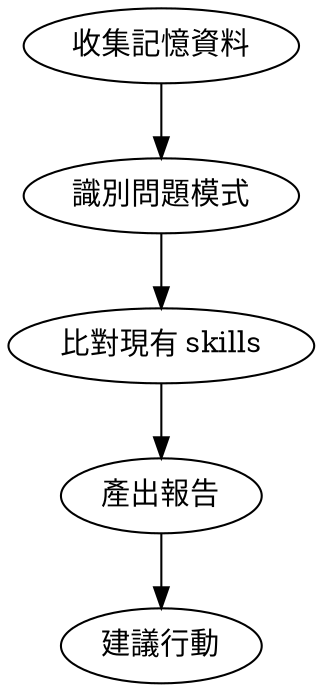

# Skill Reviewer - 技能缺口分析

## Overview

**分析記憶，發現缺口，建議改進。** 透過 claude-mem 歷史資料識別重複問題模式，找出未被 SOP 化的常見問題。

## When to Use

- 使用者要求檢視 skill 覆蓋率
- 完成複雜 debugging session 後
- 發現自己在重複解決類似問題
- 背景 hook 觸發（每 N 個 session）

## 分析流程



## Step 1: 收集記憶資料

查詢 claude-mem 的關鍵類別：

```
# 1. 近期 bugfix（重複修復 = 需要 skill）
search(query="", obs_type="bugfix", limit=30, orderBy="date_desc")

# 2. 調試相關（反覆調試 = 缺少 SOP）
search(query="debug fix error 修復 修正", limit=20)

# 3. 決策記錄（重複決策 = 需要模式）
search(query="", obs_type="decision", limit=20)
```

## Step 2: 識別問題模式

分析記憶尋找：

| 模式類型 | 指標 | 意義 |
|---------|------|-----|
| **重複 Bugfix** | 相似標題/概念出現 3+ 次 | 需要 debugging skill |
| **手動解決** | 解決問題但沒調用 skill | skill 覆蓋範圍不足 |
| **長時間調試** | 單個問題跨多個 observation | 缺少系統性方法 |
| **相同決策** | 類似 decision 重複出現 | 應該 SOP 化 |

## Step 3: 比對現有 Skills

列出 `~/.claude/skills/` 中的 skills，檢查：

```bash
ls ~/.claude/skills/
```

### Step 3.1: 使用 /context 檢視

執行 `/context` 命令可視化當前 skills：
- 按來源分組（user skills, plugin skills）
- 按 token 數量排序
- 快速識別哪些 skills 佔用最多 context

> 💡 Claude Code v2.0.74 改進了 /context 命令，可以更清楚看到 skills 分佈

**比對問題：**
- 這個問題類別有對應 skill 嗎？
- 如果有，為什麼沒被使用？（description 不夠準確？觸發條件不對？）
- 如果沒有，是否值得建立新 skill？

## Step 4: 產出報告

### 報告格式

```markdown
# Skill Review Report - [日期]

## 發現的問題模式

### 1. [模式名稱]
- **出現頻率**: N 次
- **相關記憶**: #ID1, #ID2, #ID3
- **現有 skill**: [有/無] - [skill 名稱]
- **建議**: [新建 skill / 改進現有 / 無需處理]

## 行動建議

### 高優先級
- [ ] 建立 `xxx-skill` 處理 [問題類型]

### 中優先級
- [ ] 改進 `yyy-skill` 的 description 增加 [觸發詞]

### 低優先級
- [ ] 考慮合併 `aaa` 和 `bbb` skills
```

## Step 5: 建議行動

根據報告提供具體建議：

| 情況 | 行動 |
|-----|------|
| 新問題類別頻繁出現 | 建立新 skill |
| Skill 存在但未被調用 | 改進 description/觸發條件 |
| 多個 skills 重疊 | 考慮合併 |
| 單次問題 | 無需處理 |

## 自動觸發設置

在 `~/.claude/settings.json` 的 hooks 中加入：

```json
{
  "hooks": {
    "SessionStart": [
      {
        "matcher": "",
        "hooks": [
          {
            "type": "command",
            "command": "echo 'session_count' >> ~/.claude/session_counter.txt && wc -l < ~/.claude/session_counter.txt | xargs -I {} sh -c '[ {} -ge 10 ] && echo \"SKILL_REVIEW_TRIGGER\" && > ~/.claude/session_counter.txt'"
          }
        ]
      }
    ]
  }
}
```

當輸出包含 `SKILL_REVIEW_TRIGGER` 時，Claude 應主動執行 `/skill-review`。

## 手動觸發

使用者可隨時說：
- `/skill-review`
- "幫我檢查 skill 覆蓋率"
- "分析我的記憶找出 skill gap"

## 輸出範例

```markdown
# Skill Review Report - 2025-12-25

## 發現的問題模式

### 1. Pine Script 斜率計算問題
- **出現頻率**: 4 次 (Dec 18-21)
- **相關記憶**: #848, #956, #582, #400
- **現有 skill**: 有 - pine-debugger
- **建議**: 改進 pine-debugger 增加「斜率計算」觸發詞

### 2. Box Theory 箱體偵測過寬
- **出現頻率**: 3 次
- **相關記憶**: #954, #S276, #1064
- **現有 skill**: 無
- **建議**: 建立 `box-theory-tuning` skill

## 行動建議

### 高優先級
- [ ] 建立 `box-theory-tuning` skill 處理參數調整

### 中優先級
- [ ] 改進 `pine-debugger` description 增加「slope」「linreg」觸發詞
```

## 注意事項

- 分析時著重「重複出現」的問題，單次問題不需 skill 化
- 優先建議改進現有 skill，而非新建
- 報告要具體可執行，不要泛泛而談
